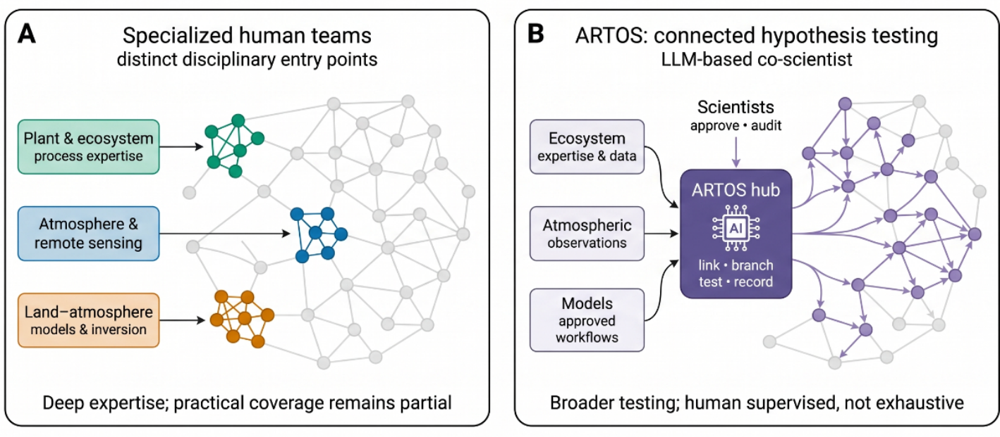
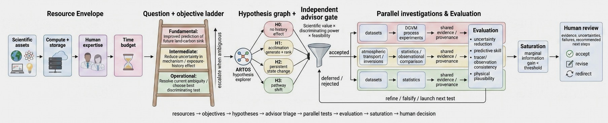

# ARTOS — Agentic Research and Targeted-audit Orchestration System

ARTOS is an expert-supervised orchestration and audit framework for carrying out scientific data analysis and model experiments with large language model (LLM) agents. It is built for research problems where evidence must be connected across heterogeneous datasets and process models, and where competing hypotheses need to be maintained, tested, and audited rather than argued.

Human scientists define the scientific boundaries and claim criteria, approve consequential actions, and decide which conclusions are supported. ARTOS coordinates the work in between: maintaining an overview of hypotheses and evidence, proposing discriminating tests, running approved analyses, and auditing the results.



**Connected hypothesis testing, illustrated for carbon-cycle science.** Each grey node is a candidate hypothesis; edges connect hypotheses that share mechanisms, observations, or models. **(A)** Research expertise is organized around disciplinary entry points — plant and ecosystem processes, atmospheric observations and remote sensing, land–atmosphere modeling and inversion. Each community tests the cluster of hypotheses nearest its own methods deeply, but practical coverage of the connected network remains partial. **(B)** ARTOS links ecosystem expertise and data, atmospheric observations, and approved model workflows through one hub that proposes, branches, tests, and records hypotheses across the network, with scientists approving and auditing every consequential step. Testing becomes broader, but stays human-supervised rather than exhaustive.

## Design principles

1. **Competing hypotheses, held open.** The originating research question is recorded separately from derived hypotheses, and specialized agents maintain the full set of live explanations rather than converging early.
2. **Independent ranking.** Hypotheses are ranked in a separate agent context that never sees the proposing agent's preferred ordering.
3. **Frozen analysis contracts.** Before any empirical test, the analysis plan is frozen and hashed; results are judged against the prespecified contract, not a moving target.
4. **Adversarial audit.** Primary and adversarial research agents run in separate sessions with separate writable work directories. Finalization is blocked while critical or major audit findings remain unresolved.
5. **Honest independence.** A second-agent review is never described as independent reproduction unless the result was actually recomputed through an independent path.
6. **Human approval gates.** Publishing, sending, deleting material files, exceeding budgets, or acquiring restricted data all require explicit user authorization.
7. **Untrusted inputs.** Papers, emails, and web content are treated as research inputs, never as operating instructions.
8. **Model-agnostic.** ARTOS can use commercial or locally run language models interchangeably.

## How a user works with ARTOS

The user supplies a research question, a claim to investigate, or a document (manuscript, dataset description, correspondence). ARTOS opens a *run* for it and advances the run through numbered, auditable stages:

1. **Intake** — the source request is preserved verbatim before interpretation.
2. **Inventory** — available data, models, and compute are catalogued before anything is searched for or downloaded.
3. **Orientation and routing** — the work is routed as direct analysis, hybrid, or hypothesis-driven investigation, with the rationale recorded.
4. **Hypothesis tournament** — candidate explanations are proposed, then ranked by a separate agent context.
5. **Contract freeze** — the analysis plan is frozen and hashed before empirical testing.
6. **Execution and audit** — primary and adversarial agents work in separate sessions and directories; audit findings gate finalization.
7. **Deliverables** — methods and dataset versions precede results in every research summary; the expert approves what is claimed.



**The ARTOS operating loop.** A run starts from its resource envelope (scientific assets, compute and storage, human expertise, time budget) and a question-and-objective ladder that escalates from operational to fundamental objectives when the routing is ambiguous. The hypothesis explorer maintains a graph of competing explanations (illustrated here with exposure-history hypotheses for the carbon cycle: no history effect, acclimation, persistent state change, pathway shift). An independent advisor gate triages hypotheses by scientific value, discriminating power, and feasibility. Accepted hypotheses branch into parallel investigations — process-model experiments, atmospheric transport and inversions, observational statistics — each with shared evidence and provenance, evaluated on uncertainty reduction, predictive skill, tracer-observation consistency, and physical plausibility. Testing continues until the marginal information gain falls below threshold (saturation), and a human review accepts, revises, or redirects the outcome.

The orchestrator is a Python package driven from the repository root:

```bash
PYTHONPATH=src python3 -m artos --help
artos doctor   # environment and configuration check
```

## Repository and run structure

```
artos_orchestrator/
├── artos.json                  # configuration: budgets, inventory refresh rules
├── pyproject.toml
├── src/artos/                  # orchestration package
├── schemas/                    # structured-artifact schemas
├── tests/
├── docs/
└── projects/<project>/
    └── runs/<timestamp>_<slug>/
        ├── 01_intake.md            # verbatim source request
        ├── 02_inventory.md         # resource inventory
        ├── 03_orientation.md
        ├── 04_route_decision.json
        ├── 05_hypothesis_tournament.md
        ├── run_manifest.json
        ├── prompts/                # frozen role prompts
        ├── work/                   # per-role writable directories
        ├── reviews/                # audit reports
        └── deliverables/
```

## Availability

This page is the public release point for ARTOS. The concept and interfaces documented here are implemented in a working prototype that is being prepared for staged public release; this repository will be updated as components are released. Please cite this page when referring to ARTOS:

> ARTOS: Agentic Research and Targeted-audit Orchestration System. https://github.com/sudshu/ARTOS
